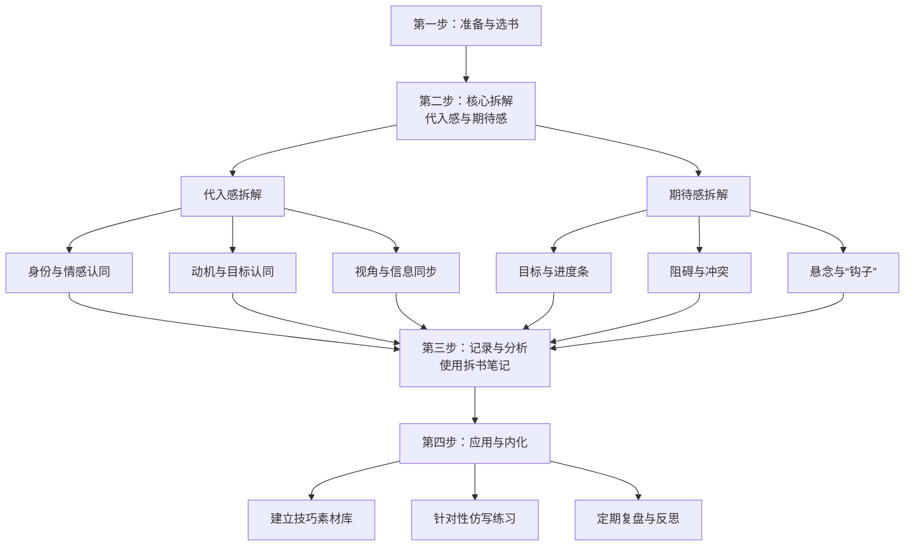

要学习别人作品中“代入感”和“期待感”的营造，**系统化地拆解（拆书）** 是一个好方法。这能帮你把阅读中的“感觉”转化为可操作的**写作技巧**。

下面是一个帮你系统拆书、获取经验的方案，核心步骤概括如下：

### 📚 拆解准备与选书

工欲善其事，必先利其器。开始拆解前，需要做好一些准备：

- **搭建你的拆书笔记系统**：准备一个你顺手的笔记软件（如印象笔记、Notion等）或实体笔记本。**按“代入感”和“期待感”等分类建立笔记**，方便后续归纳。在笔记中，可以**直接摘录原文金句**，并**记录你的分析**。

- **选择合适的书籍**：选择你所在细分领域（如玄幻、都市等）的**热门代表作或“爆款”**。这些书通常在营造代入感和期待感上有过人之处。同时，也**选择一些你个人特别喜欢的作品**，你的共鸣本身就是很好的分析素材。

### 🔎 核心拆解实操

这是拆解的核心环节，你需要带着明确的目标去精读文本。

#### **拆解“代入感”**

代入感是让读者“成为”主角的关键。拆解时代入感，你可以关注以下几点：

- **分析身份与情感认同**
    - **寻找“共性”标签**：留意主角是否有能**引发广泛共鸣的身份、职业或处境**，比如常见的“打工人”、学生等。记录下作者是如何快速让主角的这些特质引发你好感的。
    - **捕捉“情感共鸣”时刻**：当主角经历挫折、喜悦、愤怒时，你是否感同身受？**记录下这些情节和作者所用的描写手法**，例如细腻的心理活动、生动的内心独白等。

- **探究动机与目标认同**
    - **理解主角的“为什么”**：分析主角行为的**动机是否清晰、合理**，其追求的目标（比如为家族复仇、在异世界生存下去）能否让你理解甚至支持。一个能得到读者认同的目标，是代入感的重要基础。
    - **记录“愿望达成”的瞬间**：当主角克服困难、目标达成时，注意你的情绪反应。**记录下作者是如何通过铺垫和渲染，让你为主角的成功感到高兴的**。

- **审视视角与信息同步**
    - **关注视角连贯性**：检查小说是否**始终围绕主角的视角展开叙事**，避免频繁的、让读者出戏的“上帝视角”或视角混乱。
    - **留意“信息差”**：看看作者是否巧妙地控制了信息的释放，**让读者知道的和主角一样多，或者比主角略少，从而产生同步探索或好奇的感觉**。

#### **拆解“期待感”**

期待感是让读者心痒难耐、持续追更的动力。拆解时你可以关注：

- **识别目标与“进度条”**
    - **抓取核心目标**：找出主角的**长远目标**（如成为最强）和**阶段性目标**（如下周的门派考核）。**明确的目标是期待感的直接来源**。
    - **追踪“进度条”**：注意作者如何**展示主角向目标迈进的进程**，例如等级提升、获得关键物品、学会新技能等。这种“进度条”能给读者持续的追更动力。

- **分析阻碍与冲突**
    - **标记“反派”与“困境”**：**记录下主角遇到的主要阻碍**，无论是具体的反派角色、恶劣的环境还是内心的挣扎。
    - **理解冲突设计**：分析“阻碍”如何与“主角的欲望”形成冲突，**强烈的冲突是剧情发展的引擎，也是悬念的温床**。

- **剖析悬念与“钩子”**
    - **解密章节结尾**：**特别关注每一章的结尾**。作者用了什么手法（例如突然出现的敌人、一个未解的谜题、一句意味深长的话）让你迫不及待地想看下一章？这些就是“钩子”。
    - **追踪伏笔与谜题**：留意文中埋下的**伏笔和设置的谜题**。记录下它们出现和揭晓的章节，思考作者是如何通过控制信息来维持你的好奇心的。

### 📓 做好记录与分析

在拆解过程中，有效的记录和分析至关重要：

- **做好拆书笔记**：在阅读时，遇到能体现代入感或期待感的精彩段落，**随时摘录或截图保存到你的笔记系统中**。
- **深度分析而非简单摘抄**：在摘录的内容旁边，**用自己的话写下你的分析**。可以尝试使用类似 **“RIA便签读书法”** 的方法：
    - **R（阅读片段）**：摘录原文。
    - **I（重述知识）**：**用自己的理解重述**作者在这里使用了什么技巧。
    - **A（拆为己用）**：**联系自身（A1）**：这个技巧让我想起了自己写作中的什么问题？**规划应用（A2）**：我可以在自己的哪部分剧情中，尝试使用类似的技巧？

### ✍️ 应用与内化经验

拆解的最终目的是学以致用：

- **建立个人写作素材库**：将拆解过程中收集到的**经典人设、目标设定、冲突模式、悬念“钩子”等，分门别类整理到你的素材库**中。
- **针对性仿写练习**：不追求完整故事，**只针对特定技巧进行仿写**。例如，专门练习写一段能引发情感共鸣的心理描写，或者设计一个充满悬念的章节结尾。
- **定期复盘与反思**：在开始新的写作前，**回头看看自己的拆书笔记和素材库**。在写完一个章节后，对照拆解学到的经验，**反思自己在代入感和期待感营造上的得失**。

掌握拆解的方法，就像拿到了优秀作者“宝库”的钥匙。通过持续地拆解、分析和实践，你能将那些让你心动的阅读体验，转化为你笔下吸引读者的强大力量。

希望这些方法能帮你有效地向优秀的作品取经。如果你在具体拆解某一类题材时遇到困难，欢迎再来交流。